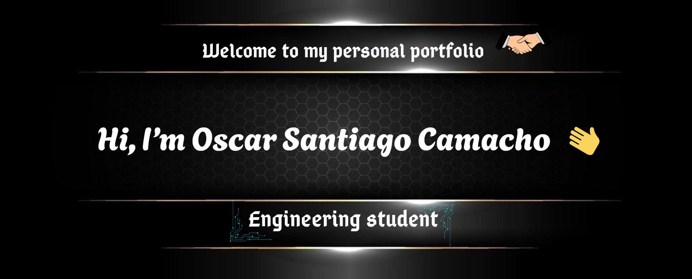

<!-- ===================== BANNER ===================== -->

  

<h1 align="center">Hi, I'm Oscar Santiago Camacho 👋</h1>
<h3 align="center">Information Systems Engineering Student · Developer &amp; Systems Analyst</h3>

  <em>I don't just build software — I analyze the whole problem before writing a single line of code.</em>

<!-- ===================== QUICK LINKS ===================== -->

  

  
  

  

---

## 👨‍💻 About Me

I'm an **Information Systems Engineering** student at the **National Technological University (UTN), Córdoba — Argentina**, building my career at the intersection of **software development** and **systems analysis**.

What sets me apart is that I care about the *entire* lifecycle of a system, not only the code. I enjoy sitting on both sides of the table: **understanding the business problem, gathering requirements and modeling processes** as an analyst, and then **designing the database and building the application** as a developer. That dual perspective helps me create solutions that are technically solid *and* actually solve the real need.

Right now I'm building **full-stack web applications** — from **React** single-page front-ends and responsive UIs with **JavaScript, HTML &amp; CSS** to **REST APIs on Node.js / Express** and **.NET / C#**, backed by relational databases through ORMs like **Sequelize** and **Entity Framework**.

> 🎯 **My goal:** grow into a well-rounded professional who can both **analyze what a system needs** and **build it** end to end.

---

## 🧩 What I Bring to the Table

<table>
  <tr>
    <td width="50%" valign="top">

### 🛠️ Development
- Object-Oriented Programming &amp; clean code principles
- **Full-stack JavaScript** development
- Front-end with **React** (components, props, state &amp; hooks)
- Back-end with **Node.js / Express** &amp; **C# / .NET**
- **REST API** design, HTTP methods &amp; status codes
- Async programming: **Promises, async/await, Fetch API**
- ORM &amp; data access with **Sequelize** &amp; **Entity Framework**
- **DOM** manipulation &amp; **SPA** architecture
- Responsive UIs with **Bootstrap**, HTML5 &amp; CSS3
- **SQL** queries, joins &amp; stored logic
- Scripting with **Python** · Functional concepts with **Haskell**

  </td>
    <td width="50%" valign="top">

### 🔎 Analysis &amp; Design
- Requirements gathering &amp; elicitation
- **Systems analysis &amp; design** methodologies
- Use cases &amp; **UML** modeling
- Business process modeling
- **Layered / n-tier architecture** &amp; separation of concerns
- **Relational database design** (ER / DER diagrams)
- Data **normalization** &amp; integrity
- Applied **probability &amp; statistics** for data analysis
- Documentation &amp; technical communication

  </td>
  </tr>
</table>

---

## 🚀 Tech Stack

**Languages**

**Front-end**

**Back-end &amp; Frameworks**

**Databases &amp; ORM**

**Analysis &amp; Modeling**

**Tools &amp; Environments**

<!-- 👉 Tweak the badges above to match exactly what you use — remove any you're not comfortable being asked about in an interview. -->

---

## 📌 Featured Projects

<!--
  👉 Replace the placeholder links (#) with your real repository URLs.
  Keep the projects that best represent you and delete the rest.
  A recruiter usually looks here FIRST — lead with your strongest work.
-->

| Project | Description | Tech |
|---------|-------------|------|
| **[Motorcycle Sales — Database System](#)** | Relational database design for a motorcycle sales domain: ER modeling, normalization and SQL queries for the full business flow. | `SQL` `DER` `Modeling` |
| **[Full-Stack Web App — React + Node.js](#)** | Single-page React front-end consuming a REST API on Node.js / Express with Sequelize ORM, following layered architecture. | `React` `Node.js` `Express` `Sequelize` |
| **[REST API with .NET &amp; Entity Framework](#)** | Back-end API built with C# / .NET and EF, applying layered architecture and clean data access. | `C#` `.NET` `EF` `REST` |
| **[Systems Analysis Case Study](#)** | Full analysis &amp; design of an information system: requirements, use cases and UML diagrams. | `UML` `Analysis` `Docs` |

> _Want to see more? Check out my [pinned repositories](https://github.com/RipollSantii66) 📂_

---

## 🌱 Currently Learning

- Deepening **React** patterns &amp; component architecture
- **REST API** design with Node.js / Express &amp; .NET
- Advanced **relational database design** and query optimization
- Best practices in **clean code** and software design patterns

---

## 📫 Let's Connect

I'm always open to opportunities, collaborations and learning from other developers and analysts. Feel free to reach out:

  
  

  <em>“First understand the problem — then build the solution.”</em>

